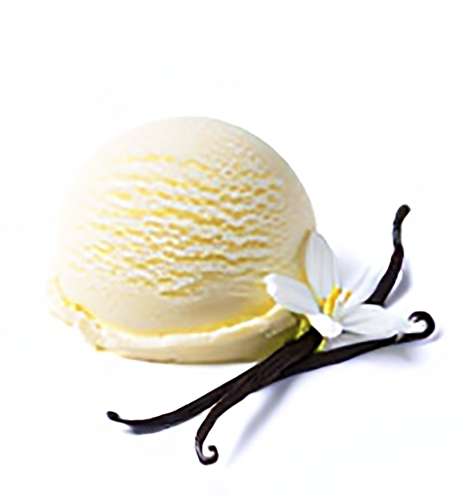
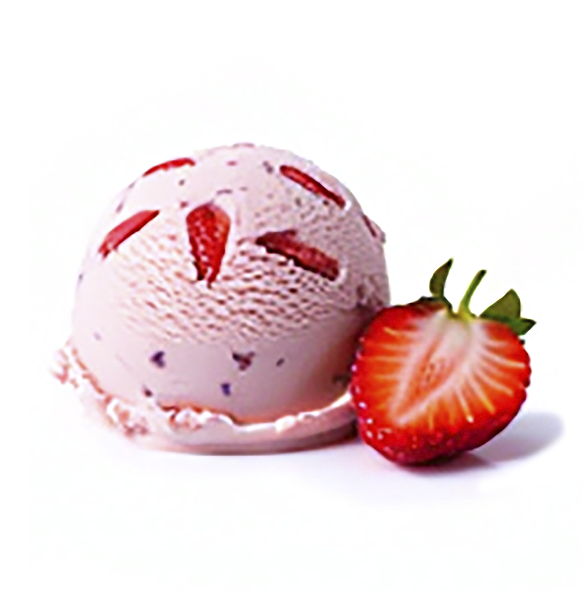
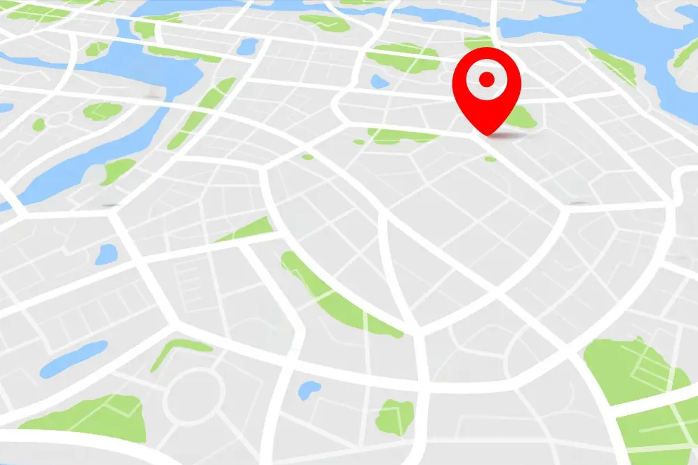

*{
    margin: 0;
    padding: 0;
    border: 0;
    font-size: 100%
    vertical-align: baseline;
}

body{
    text-align: center;
    font-family: 'Poppins', sans-serif;
}

.head {
    display: flex;
    align-items: center;
    justify-content: center;
    height: 63px;
    background: #ffffff;
    position: fixed;
    width: 100%;
    z-index: 100;
}

.navbar{
    display:flex;
    margin-right: 10px;
}

.logo {
  display: flex;
  align-items: center;    
  justify-content: center;
  height: 63px;           
}

.logo img {
  width: 120px;
  height: auto;
}

.navbar a {
    display: block;
    padding: 20px 20px;
    color: #004F8C;
    text-decoration: none;
    text-transform: uppercase;
    font-size: 20px;
    
}
.navbar a:hover{
    background: #b8defb;
}

.header {
    display: flex;
    flex-direction: column;
    align-items: center;
}

.welcome-text {
    background-color: #ffe6eb;
    width: 100%;
    padding: 50px 20px;
    text-align: center;
}

.welcome-text .title {
    color: #004F8C;
    font-size: 50px;
    margin-bottom: 20px;
}

.welcome-text p {
    color: #004F8C;
    font-size: 18px;
    margin-bottom: 20px;
}

.header-image img {
    width: 80%;
    max-width: 800px;
    height: auto;
    margin-top: 20px;
    border-radius: 20px;
}

.title{
    margin-bottom: :40px;
    font-size: 60px;
    font-weight: 600;
    text-transform: uppercase;
    color:#004F8C;
}

p{
    margin-bottom: 40px;
    font-size: 18px;
    color: #004F8C;
    padding: 0 150px;
}

.btn{
    display: inline-block;
    margin-top: 15px;
    padding: 10px 40px;
    border: 2px solid #ff4a7d;
    color: #ffffff;
    text-decoration: none;
    background: #ff4a7d;
}

.btn:hover{
    background: none;
}

.content{
    height: 60vh;
    display: flex;
    flex-direction: column;
    justify-content: center;
    align-items: center;
}

.sau{
    padding: 100px 0;
    background: #ffe6eb;  
}

.box-container{
    display: flex;
    justify-content: center;
    flex-wrap: wrap;
    text-align: center;
}

.box-container .box {
    height: 240px;
    width: 200px;
    background: #ffffff;
    text-align: center;
    border-radius: 20px;
    box-shadow: 0 2px 8px rgba(0,0,0,0.15);
    margin: 25px;
}

.box-container .box i{
    height: 40px;
    width: 40px;
    line-height: 40px;
    text-align: center;
    border-radius: 50%;
    color: #fff;
    background: #ff4a7d;
    font-size: 25px;
    margin: 10px 0;
}

.box-container .box h3 {
    font-size: 20px;
    color: #ff4a7d;
}

.box-container .box p{
    padding: 0 15px;
    font-size: 16 px;
}

.contain{
    background: url(IMG/helado%201.jpg)no-repeat center;
    width: 100%;
    height: 100vh;   
    background-size: cover;
    background-attachment: fixed;
    text-align: center;
    padding-top: 150px;
}

.about{
    background:#ffe6eb;
    padding: 150px 0;
}

.box-container2 {
  display: flex;
  justify-content: center;
  padding-top: 50px;
  flex-wrap: wrap;
}

.box p {
  margin-bottom: 5px;
}

.heart {
  text-align: center;
  margin-top: 0;
}

.heart i {
  color: #ff4a7d;
  font-size: 30px;
}

.box-container2 .box {
   width: 650px;
    padding-bottom: 20;
    text-align: center;
    border-radius: 20px;
    box-shadow: 0 2px 8px rgba(0,0,0,0.15);
    background:#ffffff;
    margin: 20px 20px;
}

.box-container2 .box img{
    height: 200px;
    width: 200px;
    object-fit: cover;
    border-radius: 50%;
    margin-top: -50px;
    border: 6px solid #ff4a7d;  
}

.box-container2 .box h3 {
    font-size: 20px;
    color:#ff4a7d;
    padding-top: 10px;
}

.box-container2 box p {
    font-size: 18px;
    color: #fff;
    padding: 0;
}

box-cotainer2 .box .heart i{
    font-size: 15px;
    color:#ff4a7d;
}

.contact {
    padding: 250px 0;
    background:#b8defb;
}

.footer-section{
    display: flex;
    flex-direction: column;
    margin: 0 100px;
}

.f-enlaces {
    text-align: center;    
    margin-bottom: 30px; 
}

.f-enlaces a {
    color: #004F8C;
    text-decoration: none;
    margin: 0 10px; 
    
}

.copyright {
    background: #ffd8e3;
    padding: 20px;
    text-align: center;
    font-size: 14px;
    width: 100%;
}

@media (max-width:768px) {
    p {
        padding: 0 50px;
    }
    .title{
        margin-bottom: 0px;
        font-size: 40px;
    }
    .sau{
        height: 80vh;
        padding: 50px 0;
    }
    .about {
        height: 100vh;
        padding: 50px 0;
    }
    .footer-section {
        display: flex;
        flex-direction: column;
    }
    .f-enlaces {
        display: none
    }
    .navbar{
        display: none;
    }

<!doctype html>
<html lang ="es"> 
<head>
    <meta charset="UTF-8">
    <meta http-equiv="X-UA-Compatible" content="IE=edge">
<meta name="viewport" content="width=device-width, initial-scale=1.0">
    <link rel="stylesheet" href="https://cdnjs.cloudflare.com/ajax/libs/font-awesome/5.15.1/css/all.min.css"/>
    
    <title>Dulce Nieve</title>
    <link rel="stylesheet" href="main.css"> 
    
</head>
<body>
    
    

        
    

          
    

    
    <nav class="navbar">
                <a href="#">Inicio</a>
                <a href="#">Sabores</a>
                <a href="#">Galería</a>
                <a href="#">Nosotros</a>
                <a href="#">Contacto</a>
    </nav>    
        
    

    
    <header class="content header">
        <h2 class="title">¡Bienvenido a Dulce Nieve!</h2>
        

            Aquí cada helado es una sonrisa hecha sabor. Disfruta de nuestras creaciones artesanales, llenas de colores vibrantes, frescura natural y un toque divertido que despierta tus sentidos.
        

        <a href="#" class="btn" >Descubrir más</a> 
    </header>
    
    
    <section class="content sau">
        <h2 class="title">Sabores</h2>        
        

        Deliciosos, frescos y listos para enamorarte.
        

        
        

        
            

                <i class="fas fa-snowflake"></i>
                <h3>Vainilla Sueño</h3>
                
            

            
            

                <i class="fas fa-snowflake"></i> 
                <h3>Fresa Primavera</h3>
                
            

            
            

                <i class="fas fa-snowflake"></i> 
                <h3>Mango Delicia</h3>
                
            

            
            

                <i class="fas fa-snowflake"></i> 
                <h3>Matcha Latte</h3>
                
            

            
        

        
    </section>
    
    <section class="content gallery">
    
        <article class="contain">
            
            <h2 class="title">Galería</h2>
            
Nos encanta ver cómo disfrutas. Etiqueta tus fotos con #momentodulcenieve para aparecer aquí.
            

            <a href="#" class="btn">Ver más</a>
            
        </article>
        
    </section>
    

    <section class="content about">
        <h2 class="title">Nosotros</h2>
        

            La historia de Dulce Nieve: Nacimos con una idea sencilla, crear helados que abrazan el corazón. Mezclamos ingredientes de calidad, recetas artesanales y un toque kawaii para que cada bocado sea un momento feliz.
        

        

            Valores: Creemos en lo natural, lo local y lo hecho a mano, con sabores honestos y detalles que sacan sonrisas.
        

        

        
            
 
                
                <h3></h3>
                
“En Dulce Nieve, cada sabor es un abrazo al corazón.”

                
<i class="fas fa-heart"></i>
                <h3></h3>
                

                  
            
  
                
        

    
    </section>
    
    <section class="content contact">
        <h2 class="title">Contacto</h2>
        
        

            
¿Un antojo, un pedido especial o un evento? ¡Escríbenos!

            
Telf:<a href="https://wa.link/rztsqy">+51 987 213 937</a>

           
            
Email: hola@dulcenieve.pe
 
            
Dirección: Calle Dulce 123, Lima 

            

            
            <figure>
                
            </figure>
                
            

                <a href="#">Inicio - </a>
                <a href="#"> Sabores -</a>
                <a href="#"> Galería -</a>
                <a href="#"> Nosotros -</a>
                <a href="#"> Contacto</a>
        

        

                
© 2025 Dulce Nieve. Todos los derechos reservados.

            

        
    </section>
    
</body>
</html>
