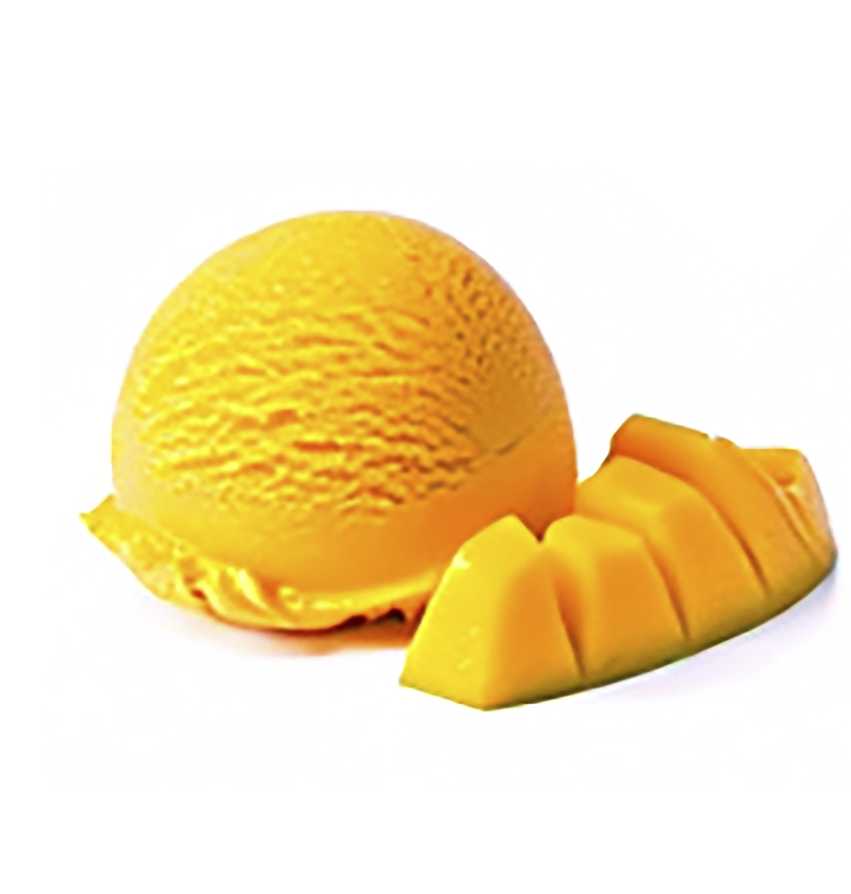
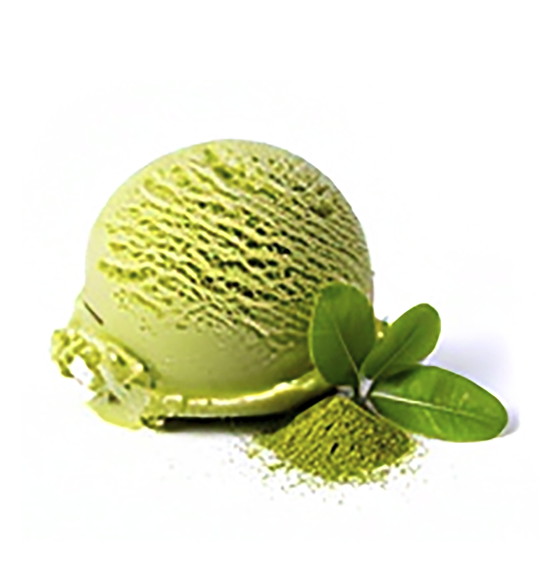

<!doctype html>
<html lang ="es"> 
<head>
    <meta charset="UTF-8">
    <meta http-equiv="X-UA-Compatible" content="IE=edge">
<meta name="viewport" content="width=device-width, initial-scale=1.0">
    <link rel="stylesheet" href="https://cdnjs.cloudflare.com/ajax/libs/font-awesome/5.15.1/css/all.min.css"/>
    
    <title>Dulce Nieve</title>
    <link rel="stylesheet" href="main.css"> 
    
</head>
<body>
    
    

        
    

          
    

    
    <nav class="navbar">
                <a href="#">Inicio</a>
                <a href="#">Sabores</a>
                <a href="#">Galería</a>
                <a href="#">Nosotros</a>
                <a href="#">Contacto</a>
    </nav>    
        
    

    
    <header class="content header">
        <h2 class="title">¡Bienvenido a Dulce Nieve!</h2>
        

            Aquí cada helado es una sonrisa hecha sabor. Disfruta de nuestras creaciones artesanales, llenas de colores vibrantes, frescura natural y un toque divertido que despierta tus sentidos.
        

        <a href="#" class="btn" >Descubrir más</a> 
    </header>
    
    
    <section class="content sau">
        <h2 class="title">Sabores</h2>        
        

        Deliciosos, frescos y listos para enamorarte.
        

        
        

        
            

                <i class="fas fa-snowflake"></i>
                <h3>Vainilla Sueño</h3>
                
            

            
            

                <i class="fas fa-snowflake"></i> 
                <h3>Fresa Primavera</h3>
                
            

            
            

                <i class="fas fa-snowflake"></i> 
                <h3>Mango Delicia</h3>
                
            

            
            

                <i class="fas fa-snowflake"></i> 
                <h3>Matcha Latte</h3>
                
            

            
        

        
    </section>
    
    <section class="content gallery">
    
        <article class="contain">
            
            <h2 class="title">Galería</h2>
            
Nos encanta ver cómo disfrutas. Etiqueta tus fotos con #momentodulcenieve para aparecer aquí.
            

            <a href="#" class="btn">Ver más</a>
            
        </article>
        
    </section>
    

    <section class="content about">
        <h2 class="title">Nosotros</h2>
        

            La historia de Dulce Nieve: Nacimos con una idea sencilla, crear helados que abrazan el corazón. Mezclamos ingredientes de calidad, recetas artesanales y un toque kawaii para que cada bocado sea un momento feliz.
        

        

            Valores: Creemos en lo natural, lo local y lo hecho a mano, con sabores honestos y detalles que sacan sonrisas.
        

        

        
            
 
                
                <h3></h3>
                
“En Dulce Nieve, cada sabor es un abrazo al corazón.”

                
<i class="fas fa-heart"></i>
                <h3></h3>
                

                  
            
  
                
        

    
    </section>
    
    <section class="content contact">
        <h2 class="title">Contacto</h2>
        
        

            
¿Un antojo, un pedido especial o un evento? ¡Escríbenos!

            
Telf:<a href="https://wa.link/rztsqy">+51 987 213 937</a>

           
            
Email: hola@dulcenieve.pe
 
            
Dirección: Calle Dulce 123, Lima 

            

            
            <figure>
                
            </figure>
                
            

                <a href="#">Inicio - </a>
                <a href="#"> Sabores -</a>
                <a href="#"> Galería -</a>
                <a href="#"> Nosotros -</a>
                <a href="#"> Contacto</a>
        

        

                
© 2025 Dulce Nieve. Todos los derechos reservados.

            

        
    </section>
    
</body>
</html>
